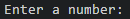
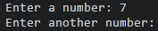
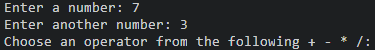
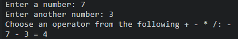
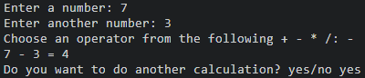
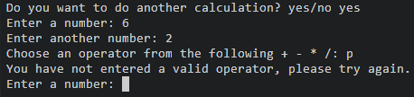
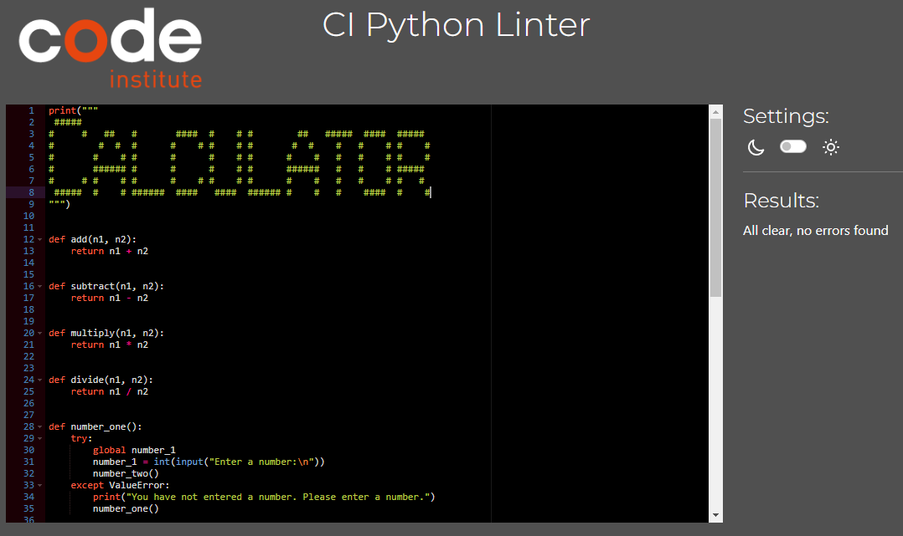

# Simple Calculator

This is a simple calculator that does addition, subtraction, multiplication and division. It also has the option to do the calculation again and it gives an error message if the user doesn't enter a correct operator.

## Features

### First number input

### Second number input

### Operator input

### Calculation and result

### Option to do another calculation

### Error handling

## Testing

I tested the code with Pyton Syntax Checker PEP8 and had no major issues with it. 

## Bugs

There was an indentation problem but it was resolved.

There was also a problem with syntax. That was resolved by replacing a = with ==.

The calculation part of the project is not working. It's showing the word "none" instead of the result of the calculation. This was resolved by adding the word "return" to the functions.

The calculator doesn't close when the user replies "no" to the question about whether they want to do another calculation. This problem has been resolved.

If the user entered an invalid operator, the game asked for them to enter another number instead of giving the error message straight away. The error message came after the user entered the second number. This issue was resolved by moving the input statement for the second number so that it comes before the operator input statement. 

There is another issue with the error handling. Straight after the error message is given, the user is asked if they want to do another calculation.

I forgot to add the brackets to the function names. This is now resolved.

I left out the colon after "else". This is now resolved.

The calculator was not doing the error message for the operator input straight after the operator input. To solve this I moved the operator input so it came last in the list of inputs.

The calculator was asking if the user would like to do another calculation straight after the operator input error message. To solve this I placed a call for the another_calculation function in the else statement.

The lower() method wasn't working and I realised that this was because the brackets were missing. I then added the brackets.

## Deployment

## Credits

I took inspiration from the following projects:

[Programiz](https://www.programiz.com/python-programming/examples/calculator)

[Built in](https://builtin.com/software-engineering-perspectives/python-calculator)

[DigitalOcean](https://www.digitalocean.com/community/tutorials/how-to-make-a-calculator-program-in-python-3)