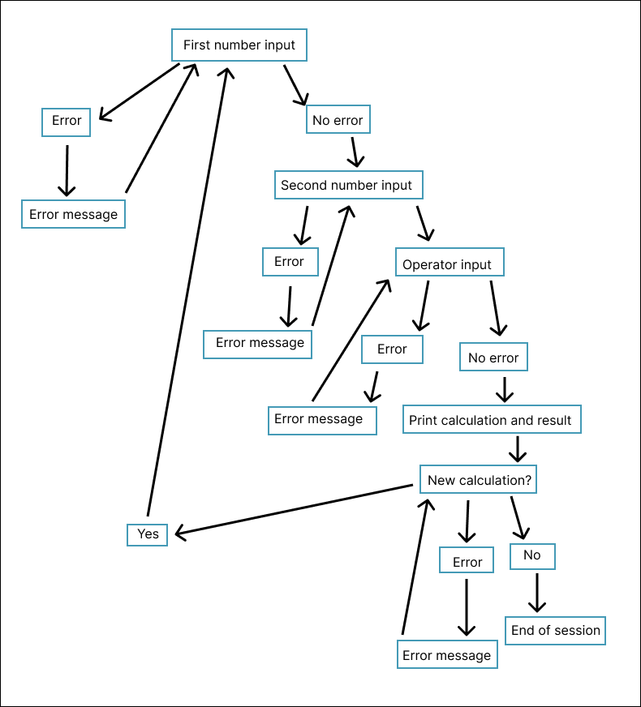
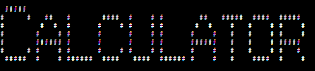

# Calculator

This is a simple calculator that does addition, subtraction, multiplication and division for the user. It also has the option to do the calculation again and it gives an error message if the user doesn't enter correct inputs.

## User flow diagram

## Features

### ASCII art

### First number input

### Second number input

### Operator input

### Calculation and result

### Option to do another calculation

### Error handling

## Testing

I tested the code with CI Python Linter and corrected all the errors with it. The code then passed with no errors. 

## Bugs

There are no current bugs in the code. Here are some of the bugs that occurred during the development:

- There was an indentation problem but it was resolved.

- There was also a problem with syntax. That was resolved by replacing a = with ==.

- The calculation part of the project was not working. It was showing the word "none" instead of the result of the calculation. This was resolved by adding the word "return" to the functions.

- The calculator didn't close when the user replied "no" to the question about whether they wanted to do another calculation. This problem has been resolved.

- If the user entered an invalid operator, the game asked for them to enter another number instead of giving the error message straight away. The error message came after the user entered the second number. This issue was resolved by moving the input statement for the second number so that it comes before the operator input statement. 

- There was another issue with the error handling. Straight after the error message was given, the user was asked if they want to do another calculation.

- I forgot to add the brackets to the function names. This is now resolved.

- I left out the colon after "else". This is now resolved.

- The calculator was not doing the error message for the operator input straight after the operator input. To solve this I moved the operator input so it came last in the list of inputs.

- The calculator was asking if the user would like to do another calculation straight after the operator input error message. To solve this I placed a call for the another_calculation function in the else statement.

- The lower method wasn't working and I realised that this was because the brackets were missing. I then added the brackets.

- After the error message for the operator was shown, the user was asked to enter a number instead of an operator. I realised this was because a number input was at the top of the function. To solve this error I had to change the code dramatically.

- I left out the colon for several functions. This has now been corrected.

- The number_1 and number_2 variables were not originally global so I made them global.

- There was a spelling error on the word "subtract". I have now corrected this.

- The calculator was closing after an error message for the first number input. I solved this by adding a call to the numbers function after the number input error messages.

- The calculator was closing after asking for the first number. I solved this by adding a call to the number_two function in the number_one function.

- There was an issue about where to put the ASCII art because it was showing whenever the user did a new calculation and I didn't want that. I wanted the ASCII art to show only at the beginning of a session so I removed it from the number_one function and added it at the very beginning of the code.

## Deployment

To deploy the project I created a new Heroku app and set the buildbacks to Python and NodeJS. Then I linked the Heroku app to the repository and deployed the app. The project was deployed using Code Institute's mock terminal for Heroku.

## Credits

- Code Institute provided the deployment terminal

- I took inspiration from the following projects:

[Programiz](https://www.programiz.com/python-programming/examples/calculator)

[Built in](https://builtin.com/software-engineering-perspectives/python-calculator)

[DigitalOcean](https://www.digitalocean.com/community/tutorials/how-to-make-a-calculator-program-in-python-3)